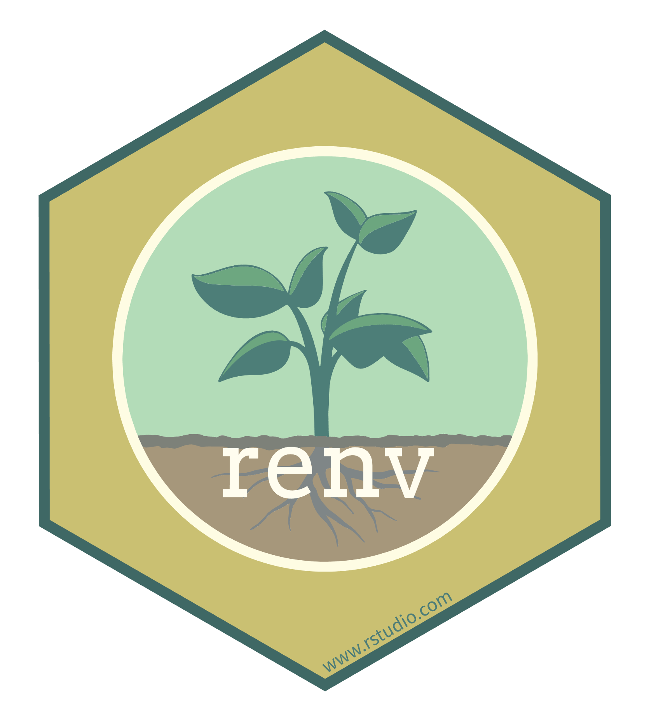

```{r setup, include=FALSE}
options(htmltools.dir.version = FALSE)
knitr::opts_chunk$set(message = FALSE, 
                      echo = FALSE, 
                      warning = FALSE,
                      fig.align = "center")
```

```{r xaringan-themer, include=FALSE, warning=FALSE}
library(xaringanthemer)
style_duo_accent(
  primary_color = "#9F999C",
  secondary_color = "#FFE5F3",
  inverse_header_color = "#8F8C8E",
  link_color = "deeppink",
  title_slide_text_color = "#3d3d3d",
  title_slide_background_image = "img/title-slide-background-light.png",
  title_slide_background_position = "left",
  header_font_google = google_font("Josefin Sans"),
  text_font_google   = google_font("Montserrat", "300", "300i"),
  code_font_google   = google_font("Fira Mono")
)
```

class: center, middle

> *You mostly collaborate with yourself, 
> and me-from-two-months-ago never responds to email.*
  > 
  > --Mark T. Holder

---

class: middle

## Why shippable and shareable computational environments

To reliably be able to reproduce an data analysis, 
we usually need more than the code and the data...

We need the software to run the code, and the correct versions of that software!
  This software can include:
  
  - programming languages (e.g., R, Python, Julia, etc)
- packages from programming languages (e.g., `tidyverse`, `tidymodels`, etc)
- other tools you rely on (e.g., GNU Make)
- legacy code (e.g., Perl scripts, Fortran, etc)

---

class: middle

## What are my options for creating shippable and shareable computational environments?

There are many software tools available to do this, 
and these fall under three general umbrellas:
  
  1. **Virtual environments (e.g., `renv`, `conda`)**
  
  2. Containerization (e.g., `Docker`, `Singularity`)

3. Virtual machines (e.g., VirtualBox, Amazon Machine Instance)

> These three umbrellas are split upon the level of where virtualization
> is performed on the computer. 
> With virtual environments being at the highest level (application),
> containerization being in the middle (operating system user-space),
> and virtual machines being at the lowest level (hardware).

---

class: middle

.pull-left[
  ## Virtual environments
  
  - let you have multiple versions of programming languages packages, 
  and other programs on the same computer, 
  while keeping them isolated so they do not create conflicts with each other.
  
  - most have a sharing functionality which aids in making data science projects reproducible
  
  - when using R and RStudio, 
  [`renv`](https://rstudio.github.io/renv/articles/renv.html) is one of the most popular choices for virtual environment software
]

.pull-right[
  ```{r renv-logo, out.width="70%", fig.align = "left"}
  
  ```
  
  *Source: https://github.com/rstudio/renv*
    
]

---

class: inverse, center, middle

## Attribution:

.pull-left[
  Much of the documentation in this hands-on portion of the workshop <br>
    comes from the excellent `renv` website: https://rstudio.github.io/renv/
    
The website and the `renv` package is written and maintained by [Kevin Ushey](https://kevinushey.github.io/).
]

.pull-right[
  
]


---

class: middle

## General workflow

The general workflow when working with renv is:
  
  1. Call `renv::init()` to initialize a new project-local environment with a private R library,

2. Work in the project as normal, installing and removing new R packages as they are needed in the project,

3. Call `renv::snapshot()` to save the state of the project library to the lockfile (called `renv.lock`),

4. Continue working on your project, installing and updating R packages as needed.

5. Call `renv::snapshot()` again to save the state of your project library if your attempts to update R packages were successful, or call `renv::restore()` to revert to the previous state as encoded in the lockfile if your attempts to update packages introduced some new problems.

---

class: middle

## Infrastructure

The following files are written to and used by projects using `renv`:
  
  | **File**            | **Usage**                                                                           |
  | -----------------   | ----------------------------------------------------------------------------------- |
  | `.Rprofile`         | Used to activate `renv` for new R sessions launched in the project.                 |
  | `renv.lock`         | The lockfile, describing the state of your project's library at some point in time. |
| `renv/activate.R`   | The activation script run by the project `.Rprofile`.                               |
| `renv/library`      | The private project library.                                                        |
| `renv/settings.dcf` | Project settings -- see `?settings` for more details.                               |

> For development and collaboration, the `.Rprofile`, `renv.lock` 
and `renv/activate.R` files should be committed to your version control system

---

class: middle

## Setting up `renv`

### Installation

- As `renv` is an R package, 
we can install it using using our familiar R package installation workflow:

```{r install-renv, echo=TRUE, eval=FALSE}
install.packages("renv")
```

---

class: middle

## Using a project where `renv` is already setup

If a collaborator has already setup an `renv` environment for the project,
you can leverage this to ensure you use the dependencies, 
and versions of those dependencies, as your collaborator 🙌

### Workflow 

1. Get a copy of the project (i.e., clone it from GitHub).

2. Open RStudio to the project working directory 
by double-clicking on the `*.Rproject` file.

3. Run `renv::restore()` to restore the project library locally on your machine.

4. Get to work!

---

class: middle

## Let's try it out!
  
  1. Click the green "Use this template" button in 
[this repository](https://github.com/ttimbers/renv-demo) 
to obtain a copy of it for yourself.

2. Clone this repository to your computer.

3. Open RStudio to the project working directory 
by double-clicking on the `*.Rproject` file.

4. Run `renv::restore()` to restore the project library locally on your machine.

5. Click the "Knit" button to run the code and reproduce the analysis!
  
---

class: middle

## Anatomy of a `renv.lockfile`

`renv.lockfile` captures the state of your library at some point in time, 
recording:
  
  - The version of `renv` used when generating the `renv.lockfile`;
- The version of R used in that project;
- The R repositories that were active when the lockfile was created;
- Package records defining each R package, their version, and their installation source.

---

class: middle

## Anatomy of a `renv.lockfile`

Here is an example lockfile which includes R and the package `markdown`:
  
  ```
{
  "R": {
    "Version": "4.2.0",
    "Repositories": [
      {
        "Name": "CRAN",
        "URL": "https://cloud.r-project.org"
      }
    ]
  },
  "Packages": {
    "markdown": {
      "Package": "markdown",
      "Version": "1.0",
      "Source": "Repository",
      "Repository": "CRAN",
      "Hash": "4584a57f565dd7987d59dda3a02cfb41"
    }
  }
}
```

---

class: middle

### Updating an `renv` environment

A common task you will need to do when you collaborate 
is to update an `renv` environment as you add dependencies to your project.

### Workflow

1. Work in the project as normal, installing and removing new R packages as they are needed in the project.

2. Call `renv::snapshot()` to save the state of the project library 
to the lockfile (called `renv.lock`).

3. Commit the changes to `renv.lock` (and your changed code!) 
to local version control,
and push the changes to your remote version control repository 
to share your environment with your collaborators.

---

class: middle

## Let's try it out!

- Install the [`statquotes`](https://github.com/friendly/statquotes) 
R package via:
  
```{r install-fortunes, echo=TRUE, eval=FALSE}
install.packages("statquotes")
```

- Add the following code to the code chunk on line 16 of `star-wars.Rmd`:
  
```{r run-fortune, echo=TRUE, eval=FALSE}
library(statquotes)
as.markdown(search_quotes("environment"))
```

- Call `renv::snapshot()` to save the state of the project library to the lockfile (called `renv.lock`).

Examine the `renv.lock` file. 
You should see something like this near line 381 of the `renv.lock` file:
  
  ```
"statquotes": {
  "Package": "statquotes",
  "Version": "0.2.6",
  "Source": "Repository",
  "Repository": "CRAN",
  "Hash": "d771dc735b1829ff511855197fc4c107",
  ```
  
  - To share the changes to the environment, 
  commit the changes to the `renv.lockfile` 
  and push them to your remote version control repository.
  
---

class: middle
  
### Creating an `renv` environment from scratch
  
What if a collaborator hasn't setup an environment for you, 
you then need to set it up yourself! 

### Workflow 

1. Setup a repository on GitHub and clone it to your local machine. 

2. Setup an RStudio project in your project's home directory 
  (can skip depending how you did step 1 - as this might have already happened)
  
3. Run `renv::init()` to initialize a new project-local environment with a private R library
  
4. Work in the project as normal, installing and removing new R packages as they are needed in the project.
  
5. Call `renv::snapshot()` to save the state of the project library to the lockfile (called `renv.lock`).
  
6. Put the `.Rprofile`, `renv.lock` and `renv/activate.R` files under local 
  and remote version control to share your environment with your collaborators.
  
---

class: middle
  
## Let's try it out!
  
1. Click the green "Use this template" button in 
  [this repository](https://github.com/ttimbers/no-renv-project) 
  to obtain a copy of it for yourself.
  
2. Clone this repository to your computer using RStudio's version control tools.

3. Examine `script.r` to see what packages the project depends on.

4. Run `renv::init()` to initialize a new project-local 
environment with a private R library.

5. Put the `.Rprofile`, `renv.lock` and `renv/activate.R` files under local 
and remote version control.

Examine the `renv.lock` file - 
do the packages there match what you saw at the top of `script.r` - 
that's neat... How does that work???
    
---

class: middle
  
### Dependency Discovery
  
- By default, `renv::snapshot()` will examine your project’s R files to determine which packages are used in your project, and will include only those packages (alongside their recursive dependencies) in the lockfile. 
  
- renv does this by scanning your code for calls to `library()` or `require()`.
  
---

class: middle
  
### Other neat things you can do with `renv`
  
- update all packages in a project library are updated to the  latest-available versions via `renv::update()`
  
- use a `DESCRIPTION` file 
  to explicitly declare which packages are used in your project 
  (see [docs](https://rstudio.github.io/renv/articles/renv.html#explicit-snapshots))
              
     - pair with a Python version and Python virtual environment 
              (see [docs](https://rstudio.github.io/renv/articles/python.html))
              
     - and more! [Read the docs!](https://rstudio.github.io/renv/index.html)
              
---

### References
                
Ushey K (2022). renv: Project Environments. R package version 0.15.5, https://rstudio.github.io/renv/
                
Timbers, T.A., Ostblom, J., D’Andrea, F., Lourenzutti, R. (2022). Reproducible and Trustworthy Workflows for Data Science. https://ubc-dsci.github.io/reproducible-and-trustworthy-workflows-for-data-science/
                
